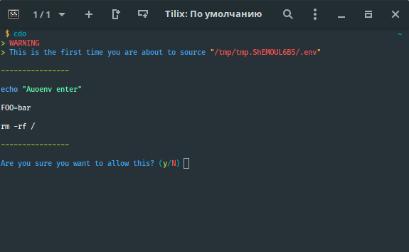

# Autoenv

Until recently, the default name was `.env`, but now it is `.in`. This is done in order not to conflict with `.env` files from numerous projects.

#### Autoenv automatically sources (known/whitelisted) `.in` and `.out` files.

This plugin support for enter and leave events. By default `.in` is used for entering, and `.out` for leaving. And you can set variable `CLICOLOR=1` for enabling colored output.

The environment variables `$AUTOENV_IN_FILE` & `$AUTOENV_OUT_FILE` can be used
to override the default values for the names of `.in` & `.out` respectively.



## Example of use

- If you are in the directory `/home/user/dir1` and execute `cd /var/www/myproject` this plugin will source following files if they exist

```
/home/user/dir1/.out
/home/user/.out
/home/.out
/var/.in
/var/www/.in
/var/www/myproject/.in
```

- If you are in the directory `/` and execute `cd /home/user/dir1` this plugin will source following files if they exist

```
/home/.in
/home/user/.in
/home/user/dir1/.in
```

- If you are in the directory `/home/user/dir1` and execute `cd /` this plugin will source following files if they exist

```
/home/user/dir1/.out
/home/user/.out
/home/.out
```

## Examples of `.in` and `.out` files

### For node.js developing:

### .in

```sh
nvm use node
OLDPATH=$PATH
export PATH=`pwd`/node_modules/.bin:$PATH

```

### .out

```sh
nvm use system
export PATH=$OLDPATH

```

### For projects with `.env` or/and `.env.local`

```sh
source .env*
```


## Installation

### Using [zpm](https://github.com/zpm-zsh/zpm)

Add `zpm load zpm-zsh/autoenv` into `.zshrc`

### Using [oh-my-zsh](https://github.com/robbyrussell/oh-my-zsh)

Execute `git clone https://github.com/zpm-zsh/autoenv ~/.oh-my-zsh/custom/plugins/autoenv`. Add `autoenv` into plugins array in `.zshrc`

### Using [antigen](https://github.com/zsh-users/antigen)

Add `antigen bundle zpm-zsh/autoenv` into `.zshrc`

### Using [zgen](https://github.com/tarjoilija/zgen)

Add `zgen load zpm-zsh/autoenv` into `.zshrc`
